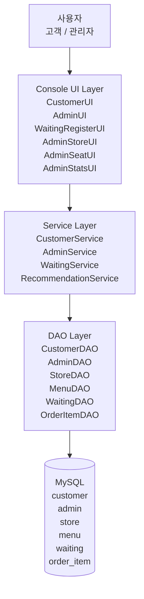
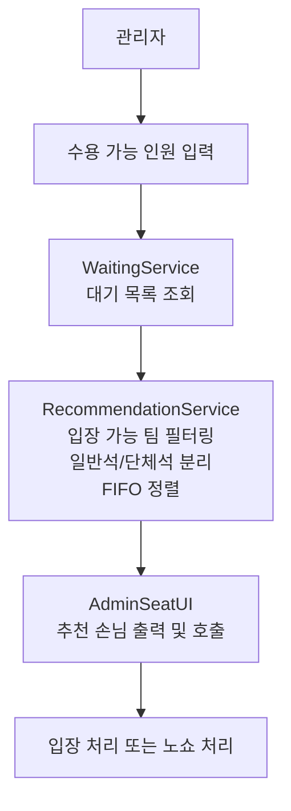

# QueueX 아키텍처 소개 자료

발표나 문서에 바로 옮겨 넣기 좋도록, QueueX의 구조를 다이어그램 중심으로 정리한 문서입니다.

## 추천 방식

이 프로젝트는 **Layered Architecture(계층형 아키텍처)** 로 소개하는 것이 가장 적절합니다.

이유는 다음과 같습니다.

- 현재 코드 구조가 `UI -> Service -> DAO -> DB` 로 명확하게 나뉘어 있습니다.
- 콘솔 앱이지만 책임 분리가 잘 되어 있어 발표 시 설명이 쉽습니다.
- QueueX의 핵심 차별점인 **추천 로직** 을 Service 계층에서 강조하기 좋습니다.

## 발표용 핵심 메시지

한 줄 소개:

> QueueX는 콘솔 기반 스마트 웨이팅 시스템으로, UI/비즈니스 로직/DB 접근을 분리한 계층형 구조 위에 인원 수 기반 추천 로직을 올린 프로젝트입니다.

## 1. 전체 시스템 아키텍처

### 발표용 도식

```text
┌──────────────┐
│    사용자     │
│ 고객 / 관리자 │
└──────┬───────┘
       │
       v
┌──────────────────────────────────────────────┐
│               Console UI Layer              │
│ CustomerUI / AdminUI / WaitingRegisterUI    │
│ AdminStoreUI / AdminSeatUI / AdminStatsUI   │
└──────────────────┬───────────────────────────┘
                   │
                   v
┌──────────────────────────────────────────────┐
│              Service Layer                  │
│ CustomerService / AdminService              │
│ WaitingService / RecommendationService      │
└──────────────────┬───────────────────────────┘
                   │
                   v
┌──────────────────────────────────────────────┐
│                DAO Layer                    │
│ CustomerDAO / AdminDAO / StoreDAO           │
│ MenuDAO / WaitingDAO / OrderItemDAO         │
└──────────────────┬───────────────────────────┘
                   │
                   v
┌──────────────────────────────────────────────┐
│                 MySQL DB                    │
│ customer / admin / store / menu             │
│ waiting / order_item                        │
└──────────────────────────────────────────────┘
```

### 발표 멘트 예시

- 사용자 입력은 모두 UI 계층에서 받습니다.
- 실제 비즈니스 판단은 Service 계층에서 처리합니다.
- DB 조회와 저장은 DAO 계층으로 분리했습니다.
- 따라서 화면 변경, 정책 변경, DB 접근 로직을 서로 독립적으로 관리할 수 있습니다.

## 2. QueueX 핵심 차별점 아키텍처

QueueX는 단순 FIFO 웨이팅이 아니라, **현재 매장 상황에 맞는 손님을 추천하는 구조** 를 가지고 있습니다.

### 핵심 포인트

- FIFO 대기 순서를 완전히 버리지 않습니다.
- 다만 현재 수용 가능한 인원 수를 기준으로 입장 가능한 팀을 먼저 추립니다.
- 일반석과 단체석 운영을 분리해 실제 매장 운영 방식에 가깝게 설계했습니다.

### 추천 로직 흐름도

```text
[관리자]
  |
  v
현재 수용 가능 인원 입력
  |
  v
[WaitingService]
대기 목록 조회
  |
  v
[RecommendationService]
1. 현재 인원으로 입장 가능한 팀 필터링
2. 일반석 / 단체석 조건 분기
3. FIFO 기준 우선순위 정렬
4. 추천 대상 반환
  |
  v
[AdminSeatUI]
추천 손님 출력 및 호출
  |
  v
입장 처리 또는 노쇼 처리
```

### 발표 멘트 예시

- QueueX의 핵심은 RecommendationService입니다.
- 관리자가 지금 몇 명을 받을 수 있는지만 입력하면, 시스템이 대기 목록 중 입장 가능한 팀을 추려 추천합니다.
- 즉 단순히 먼저 온 순서만 보여주는 것이 아니라, 실제 회전율을 고려한 운영 지원 시스템으로 설명할 수 있습니다.

## 3. 실행 환경까지 포함한 구조

발표에서 Docker/MySQL까지 같이 보여주고 싶다면 아래 구조가 적당합니다.

```text
┌───────────────────────────┐
│        Docker App         │
│ Java 17 + Maven build     │
│ 실행: app.Main            │
└─────────────┬─────────────┘
              │ JDBC
              v
┌───────────────────────────┐
│       MySQL 8.4           │
│ schema.sql / seed.sql     │
└───────────────────────────┘
```

설명 포인트:

- 애플리케이션은 Java 17 기반 Maven 프로젝트입니다.
- Docker Compose로 앱과 MySQL을 함께 띄울 수 있습니다.
- DB는 `schema.sql`, `seed.sql` 로 초기 상태를 재현할 수 있습니다.

## 4. Mermaid 버전

발표 자료나 Markdown 문서에 붙여 넣기 쉽게 Mermaid 코드도 같이 정리합니다.

### 전체 구조도



### 추천 로직 구조도



## 5. 발표 자료에서는 이렇게 그리면 좋음

가장 추천하는 PPT 구성은 아래 2장입니다.

### 슬라이드 1. 전체 구조

- 사용자
- UI 계층
- Service 계층
- DAO 계층
- MySQL

슬라이드 제목 예시:

> QueueX 시스템 아키텍처

### 슬라이드 2. 핵심 로직

- 관리자 수용 가능 인원 입력
- 대기 목록 조회
- 추천 로직 수행
- 추천 고객 호출
- 입장/노쇼 처리

슬라이드 제목 예시:

> QueueX의 핵심 차별점: 스마트 추천 웨이팅

## 6. 발표 때 강조하면 좋은 포인트

- 단순 예약/대기 앱이 아니라 **운영 의사결정을 도와주는 시스템** 이라는 점
- FIFO를 유지하되, **현재 좌석 상황** 을 함께 반영한다는 점
- `UI`, `Service`, `DAO` 를 분리해 유지보수성을 확보했다는 점
- 추천 로직을 별도 서비스로 분리해 정책 변경에 대응하기 쉽게 만들었다는 점

## 7. 한 줄 결론

QueueX는 발표 시 **계층형 아키텍처 + 추천 로직 흐름도** 조합으로 소개하는 것이 가장 이해가 빠르고, 프로젝트의 차별점도 잘 드러납니다.
